# Results and Discussion: Reactive-Transport Control of Finite-Offset Seismoelectric Interface Responses

## Writing Diagnosis

Current stage: Stage 3 to Stage 4, mechanism construction and reader-experience optimization.

Core storyline: carbonate dissolution changes hydraulic connectivity and pore-fluid conductivity; their competition reshapes the interfacial electrokinetic current imbalance, which is transferred through $L(\omega)$, $\sigma(\omega)$, Schakel-type conversion coefficients, and Liu-type finite-offset waveforms.

Main writing rule used here: figures are treated as evidence in one mechanism chain, not as isolated outputs.

## English Version

### 1. Workflow and Timescale Separation

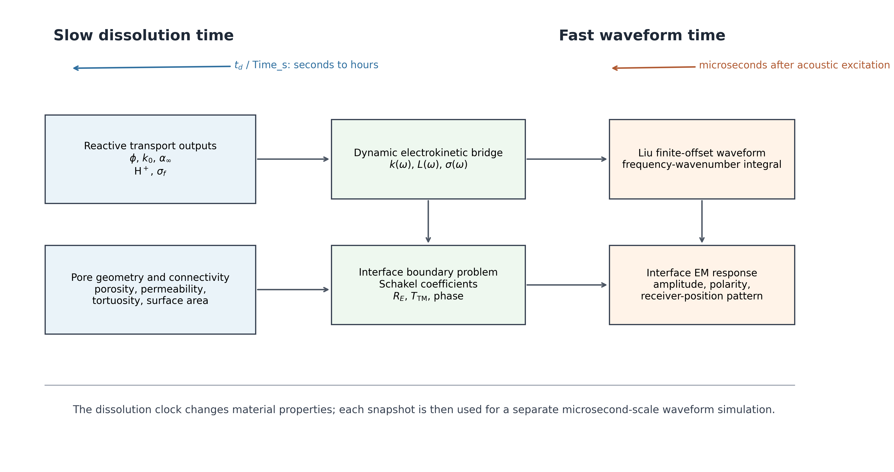

Figure 1 defines the logic of the forward-modeling framework. Reactive transport evolves over dissolution time, during which porosity, permeability, tortuosity, $\mathrm{H}^+$ concentration, and pore-fluid conductivity change gradually. Each dissolution state is then mapped into dynamic electrokinetic properties and used as a fixed material state for a separate waveform calculation over microsecond-scale waveform time. This distinction is essential: the waveform does not represent chemical evolution itself, but the seismoelectric response of one chemically evolved state. The figure therefore establishes the evidence chain used below, from reactive transport outputs to dynamic electrokinetic coefficients, interface conversion coefficients, and finite-offset interface EM waveforms.

### 2. Dissolution Produces Coupled Hydraulic and Electrical Changes

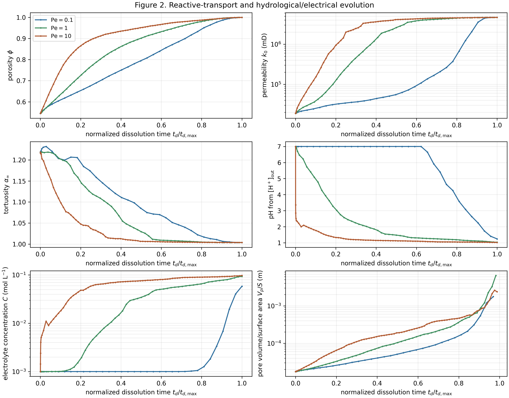

Figure 2 shows that dissolution modifies the porous medium through coupled hydraulic and electrical pathways rather than through porosity alone. Within the valid poroelastic window, porosity increases from 0.545 to 0.933 for Pe = 0.1, and to about 0.945-0.948 for Pe = 1 and Pe = 10. Permeability increases by about 20 times for Pe = 0.1 but by more than 200 times for Pe = 1 and Pe = 10, indicating stronger hydraulic connectivity in the higher Pe cases. However, this hydraulic enhancement is accompanied by a much stronger increase in electrolyte concentration and dynamic conductivity for Pe = 1 and Pe = 10. This divergence sets up the central mechanism: dissolution can open flow pathways while simultaneously making the pore fluid more electrically conductive, which can reduce the relative strength of electrokinetic coupling.

### 3. Dynamic Electrokinetic Bridge Between RT Outputs and SE Response

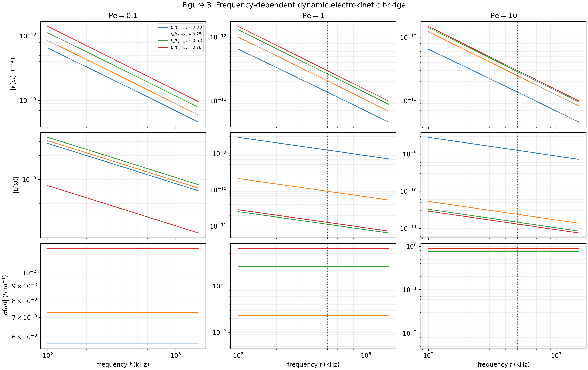

Figure 3 translates the reactive-transport outputs into the frequency-dependent properties that actually enter the seismoelectric equations. The dynamic conductivity $\sigma(\omega)$ increases as pore-fluid conductivity rises, whereas the coupling coefficient $L(\omega)$ decreases strongly in the Pe = 1 and Pe = 10 cases. The cross-case summary shows that $|\sigma|$ increases by about 114-158 times in the higher Pe cases, while $|L|$ decreases to about 1% of its initial value. This bridge explains why permeability alone is not a reliable predictor of the interface EM response. The source strength depends on the competition between increased hydraulic mobility and increased electrical leakage through $L(\omega)$ and $\sigma(\omega)$.

### 4. Interface Coefficients Transfer the Dynamic Bridge Into Conversion Strength

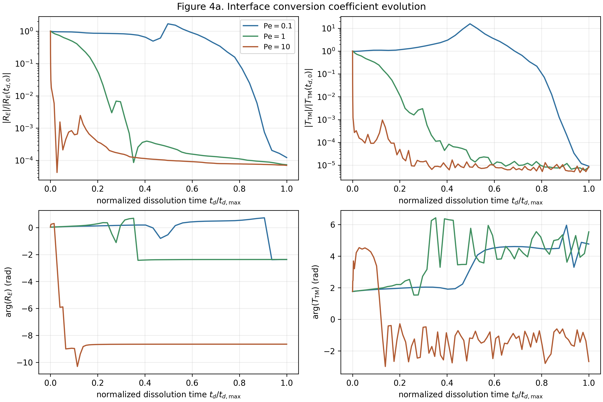

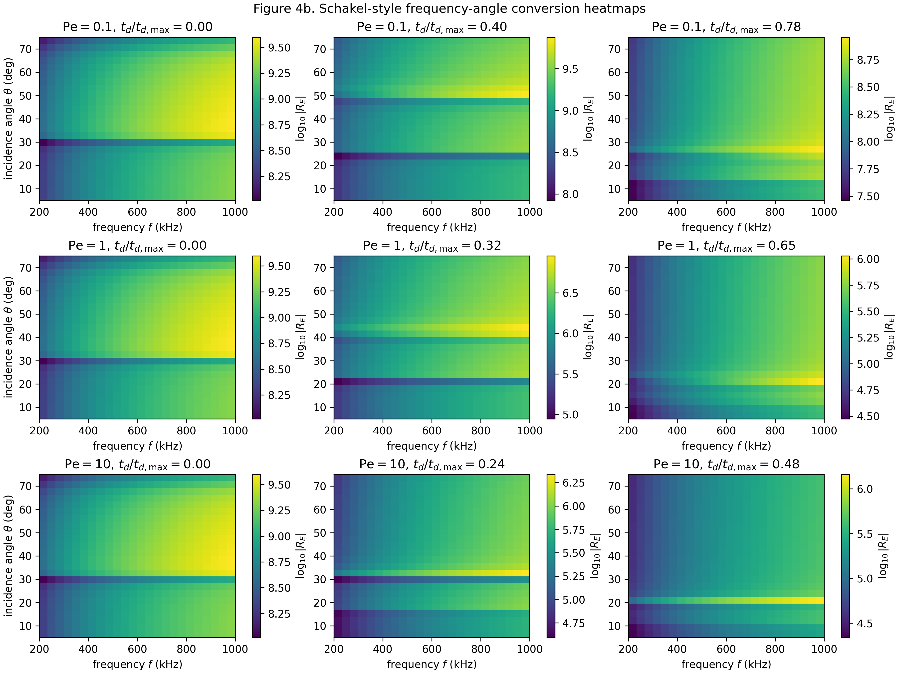

Figure 4 shows how the dynamic property changes are transferred into Schakel-type interface conversion coefficients. The magnitude of $R_E$ decreases to about 0.16 of its initial value for Pe = 0.1, but falls to about $10^{-4}$ of its initial value for Pe = 1 and Pe = 10. $T_{\mathrm{TM}}$ shows a similar suppression in the higher Pe cases. These trends indicate that the interface conversion is controlled less by the absolute increase in permeability than by the conductivity-driven reduction of electrokinetic contrast. The frequency-angle heatmaps add a useful check: the conversion strength varies with the incident wavefield and frequency, but the dissolution-driven suppression persists across the scanned coefficient space.

### 5. Finite-Offset Waveforms Preserve the Mechanism in Waveform Time

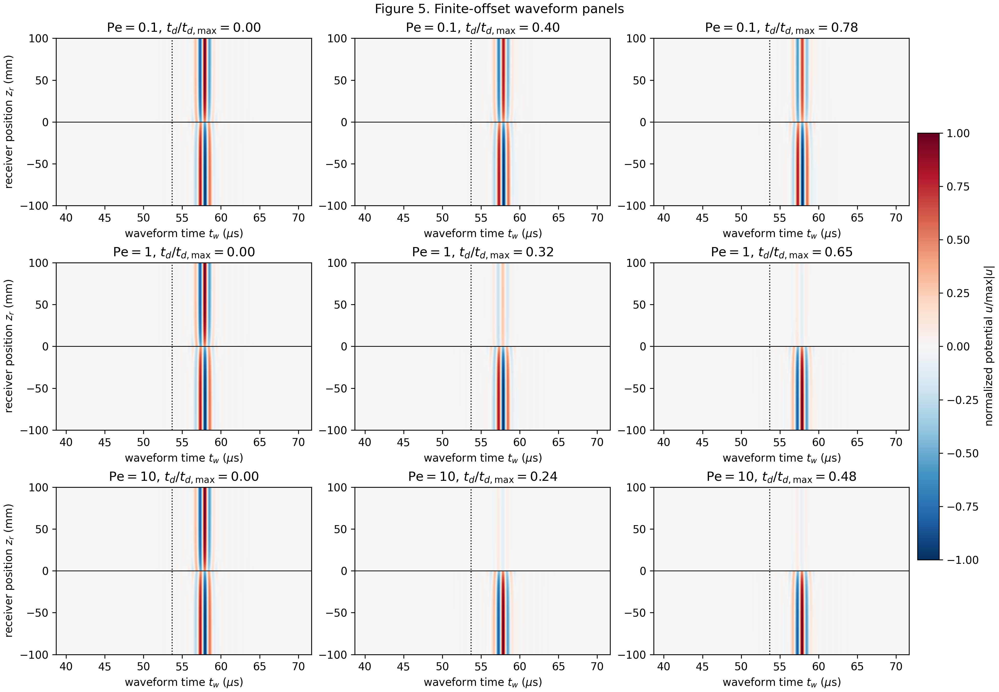

Figure 5 carries the coefficient-level changes into finite-offset waveform time. The panels are indexed by dissolution state, but the horizontal axis is waveform time after acoustic excitation. In all three Pe cases, the main interface response appears after the acoustic interface-arrival time $T_0$, while the amplitude decreases as dissolution proceeds. The late-stage post-$T_0$ peak amplitude is about $1.6\times10^{15}$ for Pe = 0.1, compared with about $1.8\times10^{12}$ for Pe = 1 and $1.3\times10^{12}$ for Pe = 10. Thus, the finite-offset waveform response preserves the same mechanism inferred from the dynamic coefficients and conversion factors: the higher Pe cases develop stronger hydraulic connectivity, but their conductivity increase suppresses the electrokinetic source more strongly.

### 6. $T_0$ and Frequency-Sampling Diagnostics

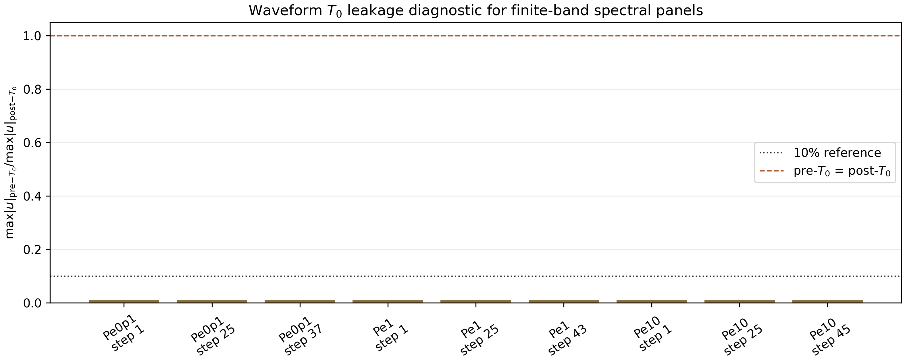

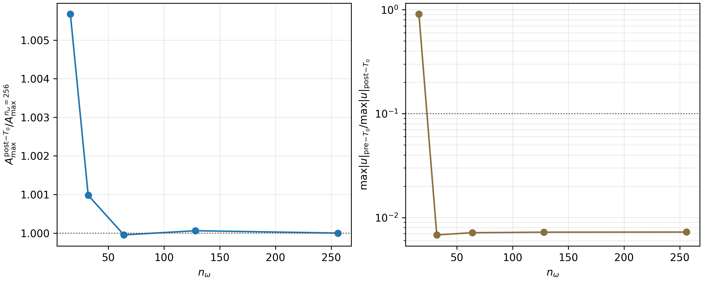

The waveform panels were checked for pre-$T_0$ numerical leakage because a coarse frequency grid can create periodic time-domain aliases in frequency-wavenumber synthesis. The convergence diagnostic shows that $n_\omega=16$ produces a large pre-$T_0$ artifact, with a pre/post-$T_0$ ratio close to 0.94. Increasing the frequency sampling to $n_\omega=128$ pushes these aliases outside the displayed time window and reduces the pre/post-$T_0$ ratio to about 0.011-0.012 across all nine waveform panels. The post-$T_0$ peak is also stable relative to the $n_\omega=256$ reference. This diagnostic supports the interpretation that the plotted interface response is not dominated by pre-arrival leakage.

### 7. Spatial Peak Pattern and Dipole Interpretation

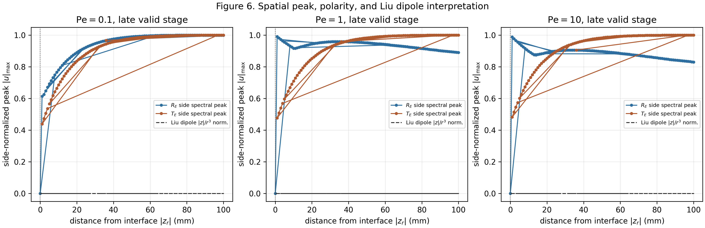

Figure 6 examines whether the finite-offset waveform has the spatial organization expected for an interface EM response. The modeled peaks vary systematically with receiver position and show different behavior on the reflected and transmitted sides of the interface. The Liu-type dipole curve is used only as a normalized interpretation of spatial directivity; it is not multiplied back into the forward waveform. This distinction matters because the waveform amplitude is already produced by the Schakel/Liu spectral synthesis, whereas the dipole pattern helps explain why finite-offset receiver position and polarity affect the observed spatial distribution.

### 8. Mechanism Decomposition

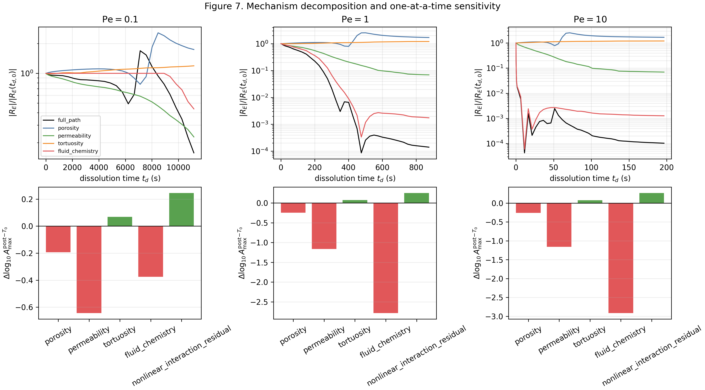

Figure 7 separates the main parameter pathways using one-at-a-time substitutions. In all three Pe cases, the tortuosity pathway alone produces a small positive contribution to the waveform peak, while porosity, permeability, and fluid chemistry pathways reduce the response in the tested configuration. The largest negative contribution comes from fluid chemistry in Pe = 1 and Pe = 10, with log10 peak changes of about -2.78 and -2.91, compared with full observed changes of about -3.86 and -3.99. This result identifies the dominant physical control: the late-stage amplitude loss is not simply a permeability effect. It is mainly caused by conductivity-driven weakening of electrokinetic coupling, with nonlinear interactions providing a smaller compensating contribution.

### 9. Normalized Monitoring Metrics

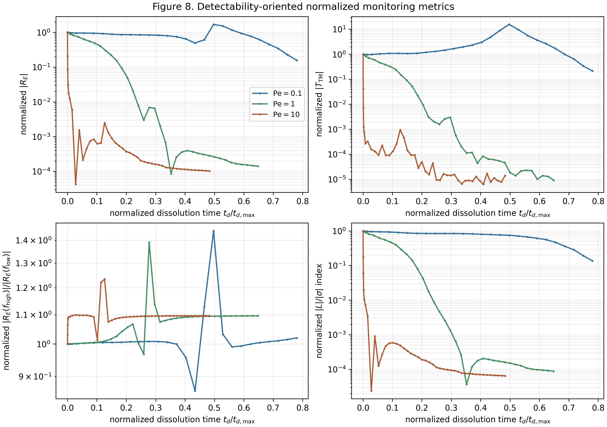

Figure 8 evaluates normalized response metrics as cautious monitoring indicators within the simulations. The normalized $R_E$ metric decreases to about 0.16 for Pe = 0.1 and to about $10^{-4}$ for Pe = 1 and Pe = 10. The $|L|/|\sigma|$ index decreases even more strongly in the higher Pe cases, consistent with conductivity-controlled suppression of electrokinetic coupling. By contrast, the simple high-over-low frequency ratio changes more modestly. These results suggest that normalized amplitude and coupling indices are more sensitive to dissolution-driven conductivity effects than the spectral ratio used here. They should be interpreted as simulation-based diagnostic quantities, not as evidence of field detectability or experimental validation.

### Integrated Interpretation

Taken together, the figure sequence supports a mechanism-based interpretation of reactive-transport control on seismoelectric interface responses. Dissolution increases porosity and permeability, especially in the higher Pe cases, but it also increases pore-fluid conductivity. The conductivity increase raises $\sigma(\omega)$ and reduces the effective coupling strength $L(\omega)$, which suppresses Schakel-type conversion coefficients and reduces the post-$T_0$ finite-offset waveform amplitude. The spatial distribution and dipole comparison then show how this weakened source is expressed along the receiver line. The result is not a simple rule that "more dissolution produces stronger seismoelectric signals." Instead, the simulations indicate a competition: hydraulic connectivity can increase, while electrical leakage can reduce the electrokinetic current imbalance that drives the interface EM response.

## 中文翻译版

### 1. 工作流与时间尺度分离

图 1 定义了本研究正演框架的逻辑。反应输运过程发生在溶蚀时间尺度上，在这一慢时间中，孔隙率、渗透率、曲折度、$\mathrm{H}^+$ 浓度和孔隙流体电导率逐渐变化。每一个溶蚀状态随后被映射为动态电动参数，并作为一个固定材料状态进入微秒级波形正演。因此，波形时间并不表示化学演化本身，而表示某一个已经演化后的介质状态对声波激发的震电响应。这个图首先建立了后文的证据链：反应输运输出改变动态电动参数，动态参数改变界面转换系数，最终控制有限偏移距 interface EM 波形。

### 2. 溶蚀同时改变水力通道和电性通道

图 2 表明，溶蚀改变的不是单一孔隙率，而是一组相互耦合的水力与电性通道。在孔弹性模型仍有效的窗口内，孔隙率从 0.545 增加到 Pe = 0.1 的 0.933，以及 Pe = 1 和 Pe = 10 的约 0.945-0.948。渗透率在 Pe = 0.1 中增加约 20 倍，而在 Pe = 1 和 Pe = 10 中增加超过 200 倍，说明较高 Pe 条件下水力连通性增强更明显。然而，这种水力增强同时伴随更强的电解质浓度和动态电导率增长。这里已经出现全文的核心机制：溶蚀可以打开流动通道，但也会提高流体电导率，从而削弱相对电动耦合强度。

### 3. 从反应输运输出到震电响应的动态电动桥梁

图 3 将反应输运输出转化为真正进入震电方程的频率依赖参数。随着溶蚀推进，$\sigma(\omega)$ 随孔隙流体电导率升高而增加，而 $L(\omega)$ 在 Pe = 1 和 Pe = 10 中明显降低。跨 Pe 汇总表明，高 Pe 情况下 $|\sigma|$ 增加约 114-158 倍，而 $|L|$ 降至初始值约 1%。这说明渗透率本身不能直接预测 interface EM 响应。震电源项取决于水力迁移能力增强与电导泄漏增强之间的竞争，而这个竞争通过 $L(\omega)$ 和 $\sigma(\omega)$ 表达出来。

### 4. 界面转换系数把动态参数变化传递到转换强度

图 4 展示了动态参数变化如何进入 Schakel 类型界面转换系数。$R_E$ 幅值在 Pe = 0.1 中降至初始值约 0.16，但在 Pe = 1 和 Pe = 10 中降至约 $10^{-4}$。$T_{\mathrm{TM}}$ 在高 Pe 情况下也表现出类似抑制。这说明界面转换强度并不主要受渗透率绝对增加控制，而是强烈受电导率升高导致的电动对比度减弱控制。频率-入射角热图进一步说明，转换强度确实依赖入射波场和频率，但溶蚀导致的整体抑制在扫描的参数空间内持续存在。

### 5. 有限偏移距波形保留了同一机制

图 5 将系数层面的变化传递到有限偏移距波形时间中。每个面板对应一个溶蚀状态，但横轴是声波激发后的微秒级波形时间。三组 Pe 情况下，主 interface EM 响应都出现在声波到达界面的 $T_0$ 之后，并随溶蚀推进而减弱。晚期 post-$T_0$ 峰值在 Pe = 0.1 中约为 $1.6\times10^{15}$，而 Pe = 1 和 Pe = 10 中分别约为 $1.8\times10^{12}$ 和 $1.3\times10^{12}$。因此，有限偏移距波形保留了前面动态系数和转换系数揭示的同一机制：高 Pe 情况虽然形成更强水力连通性，但电导率增长更强，最终更显著地削弱震电源项。

### 6. $T_0$ 与频率采样诊断

由于频率-波数积分中粗糙的频率采样会在时间域产生周期性混叠，因此对 Figure 5 进行了 $T_0$ 前泄漏诊断。收敛结果显示，$n_\omega=16$ 会产生强烈的 $T_0$ 前伪影，pre/post-$T_0$ 比值接近 0.94。将频率采样提高到 $n_\omega=128$ 后，时间混叠被推到显示窗口之外，九个波形面板的 pre/post-$T_0$ 比值降至约 0.011-0.012。post-$T_0$ 峰值相对于 $n_\omega=256$ 参考值也保持稳定。这说明当前图中的主 interface EM 响应不是由 $T_0$ 前泄漏主导的。

### 7. 空间峰值、极性与偶极子解释

图 6 检查有限偏移距波形是否具有 interface EM 响应应有的空间组织。模型峰值随接收位置系统变化，并在界面反射侧和透射侧表现出不同特征。Liu 类型偶极子曲线只作为归一化空间指向性解释，不被乘回主正演波形。这一点很重要：波形幅值已经由 Schakel/Liu 谱积分自然产生，而偶极子模型只用于解释有限偏移距下接收位置和极性如何影响空间分布。

### 8. 机制分解

图 7 通过 one-at-a-time 替换分离主要物理通道。在三组 Pe 情况下，曲折度通道单独变化会对波形峰值产生小的正贡献，而孔隙率、渗透率和流体化学通道在当前配置下都会降低响应。Pe = 1 和 Pe = 10 中最大的负贡献来自流体化学，log10 峰值变化约为 -2.78 和 -2.91，而完整路径变化约为 -3.86 和 -3.99。这说明晚期幅值衰减不是简单的渗透率效应，而主要来自孔隙流体电导率升高及其导致的电动耦合减弱，非线性相互作用则提供较小的补偿项。

### 9. 归一化监测指标

图 8 在正演模拟范围内评估了几个谨慎的归一化指标。归一化 $R_E$ 在 Pe = 0.1 中降至约 0.16，而在 Pe = 1 和 Pe = 10 中降至约 $10^{-4}$。$|L|/|\sigma|$ 指标在高 Pe 情况下降得更强，与电导率控制的电动耦合抑制一致。相比之下，简单的高频/低频谱比变化较小。这说明，在当前模拟中，归一化幅值和耦合指标比这个简单谱比更敏感地反映溶蚀导致的电导率效应。它们应被理解为模拟诊断量，而不是现场可探测性或实验验证的证据。

### 综合机制解释

整体来看，这组图支持一个机制型解释：溶蚀提高孔隙率和渗透率，尤其在高 Pe 情况下更明显；但溶蚀也提高孔隙流体电导率。电导率升高使 $\sigma(\omega)$ 增大，并使有效耦合强度 $L(\omega)$ 降低，进而抑制 Schakel 类型界面转换系数，并降低 $T_0$ 后有限偏移距波形幅值。空间峰值和偶极子对照进一步说明，这个减弱后的源项如何沿接收线表现出来。因此，本结果并不支持“溶蚀越强，震电信号越强”的简单判断。更合理的解释是：水力连通性可以增强，但电导泄漏也会增强，二者竞争决定界面电动电流不平衡以及最终 interface EM 响应。
