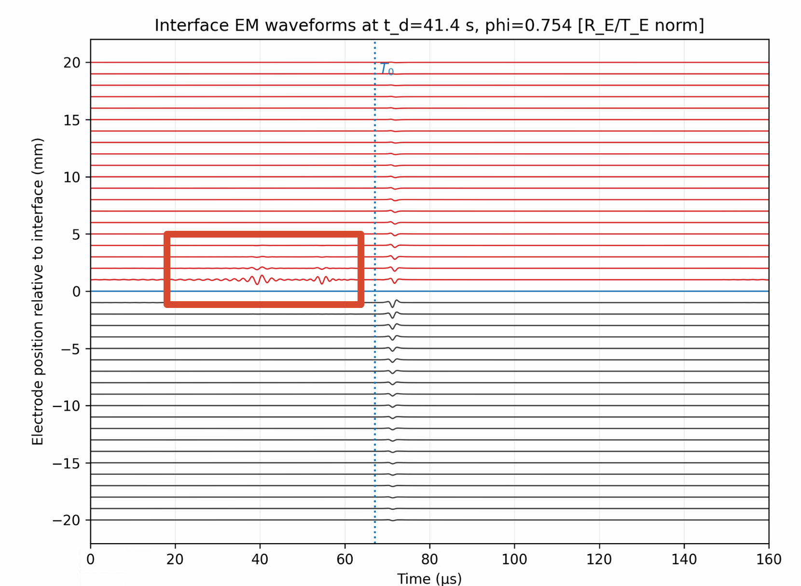

为什么：

这里面最接近界面的Re接收电极的波形图，在到时T0之前就出现了明显的波动情况，你分析一下为什么会出现这种现象。

因为：
spectral_n_omega int = 192
schakel_n_theta: int = 192
当前图的 schakel_n_theta/spectral_n_omega =48 让 T_E 侧的 Sommerfeld 积分没有充分收敛，产生了明显的 T0 前伪振铃；同时绘图函数对 R_E/T_E 两侧分别归一化显示，小幅伪波动被视觉放大。